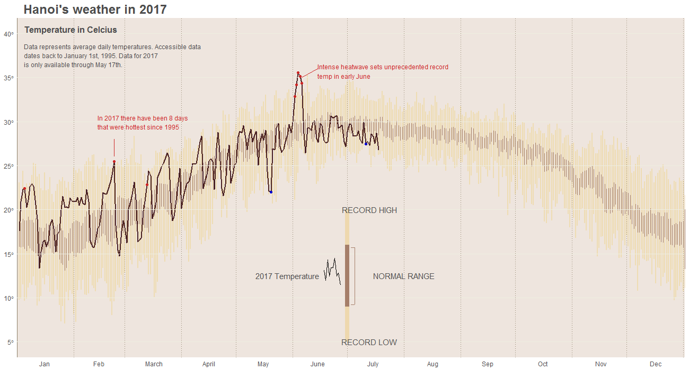

# Hanoi_2017_Weather
Based on the popular New York City's Weather Chart in 2013 by Edward Tufte

Hanoi's average temperature data can be found [here](http://academic.udayton.edu/kissock/http/Weather/citylistWorld.htm)

This report which largely mirrors [Brad Boehmke](https://rpubs.com/bradleyboehmke/weather_graphic) blogpost, provides explanation to the code
used to mimic the famous illustration of New York City's Weather Chart in 2003 by Edward Tufte in his classic book _Visual Display of 
Quantitative Information_, 2nd Ed. The script can be found in this repository or [here](http://rpubs.com/nktbinh214/297336). In additions to 
a few different implementations of Boehmke's work, some changes have been made to reflect the updates made to the packages utilized in this
report.

